# DevCollab

A comprehensive Flutter-based collaboration platform designed for teams and organizations. DevCollab provides secure authentication, organization and team management, kanban boards, real-time notifications, and dynamic theming.

## Features

- **Authentication**: Secure login and sign-up flows using Supabase and Google Sign-in.
- **Organization Management**: Create organizations, manage memberships, and assign roles (Owner, Admin, Member).
- **Team Workspaces**: Organize members into specific project teams.
- **Kanban Boards**: Track tasks with real-time kanban boards.
- **Notifications**: In-app sticky notifications and real-time alerts.
- **Dynamic Theming**: Full support for system-wide Light and Dark modes with completely dynamic UI colors.

## Tech Stack

- **Framework**: Flutter (Dart)
- **Backend & Database**: Supabase (PostgreSQL with RLS)
- **State Management**: Riverpod (`flutter_riverpod`)
- **Routing**: GoRouter (`go_router`)

## Screenshots

### Light Mode
<p float="left">
  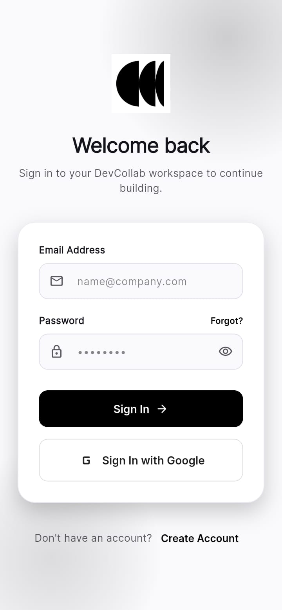
  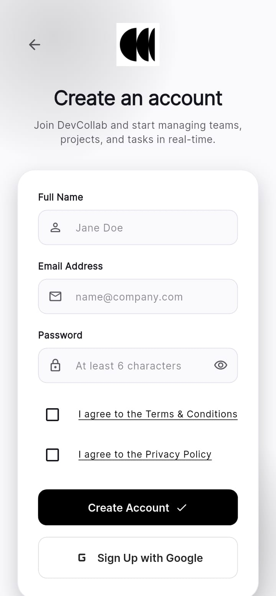
  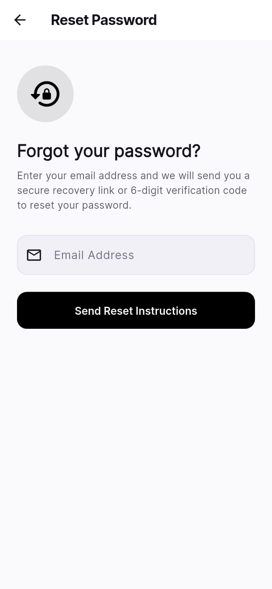
</p>
<p float="left">
  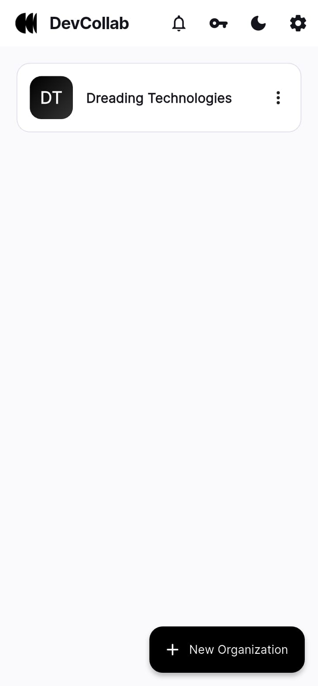
  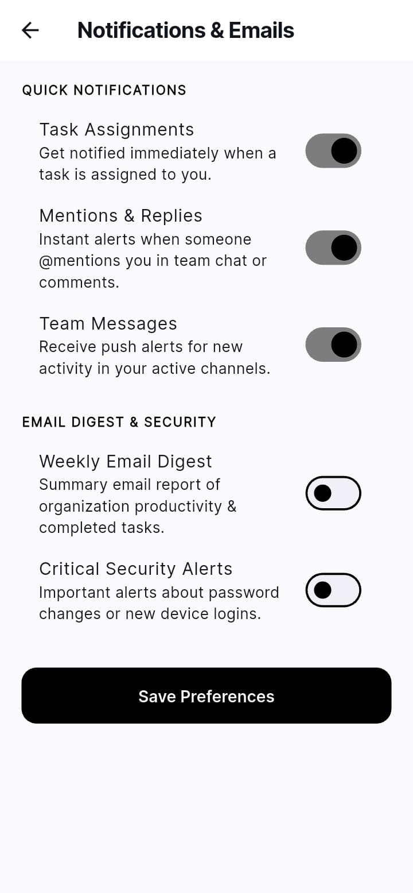
  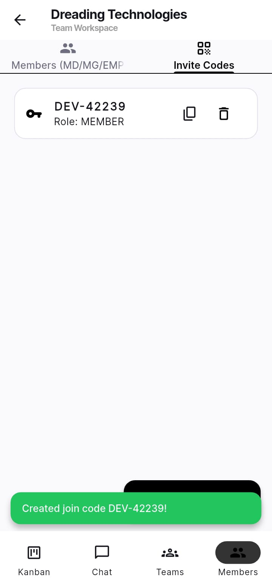 
</p>

### Dark Mode
<p float="left">
  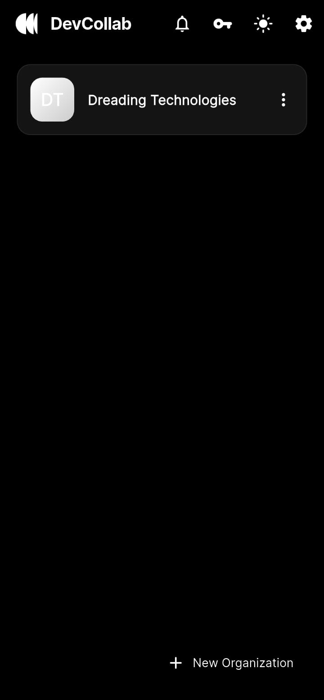
  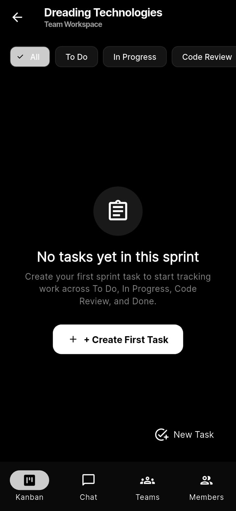
  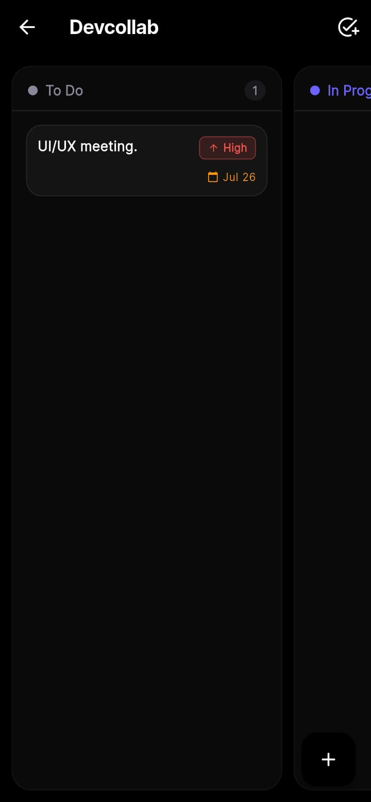
</p>
<p float="left">
  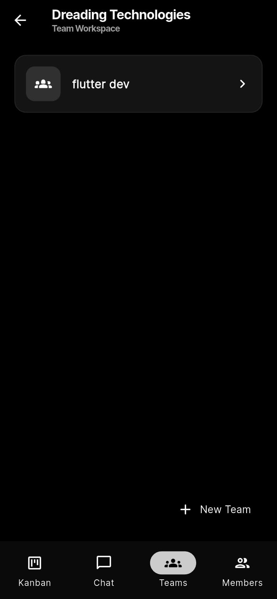
  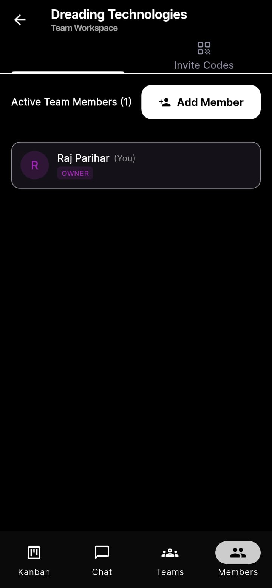
  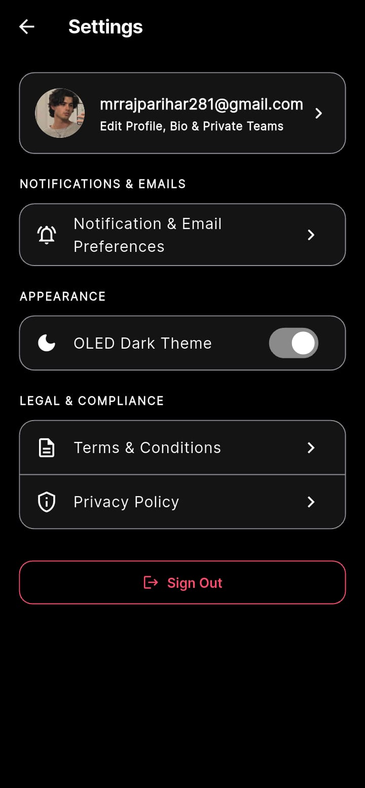
</p>

## Getting Started

### Prerequisites

To run this project, you will need the following installed:
- [Flutter SDK](https://docs.flutter.dev/get-started/install) (version 3.11.5 or higher)
- A [Supabase](https://supabase.com/) account and project.

### Setup Instructions

1. **Clone the repository:**
   ```bash
   git clone https://github.com/yourusername/DevCollab.git
   cd DevCollab
   ```

2. **Install Dependencies:**
   ```bash
   flutter pub get
   ```

3. **Configure Supabase:**
   - Create a new Supabase project.
   - Run the provided SQL migrations from `docs/database-schema.md` or `database_migration.md` in your Supabase SQL Editor to build the schema, enable Row Level Security (RLS), and set up the tables (`organizations`, `teams`, `tasks`, etc.).
   - Create a `.env` file in the root directory (if using flutter_dotenv) or update your environment variables with your Supabase URL and Anon Key.

4. **Run the App:**
   ```bash
   flutter run
   ```

## Folder Structure

- `lib/core/` - Core utilities, themes, constants, and routing.
- `lib/features/` - Feature-based modules (auth, organizations, teams, tasks, profile).
- `lib/shared/` - Shared services, widgets, and themes.
- `assets/` - Contains local images, logos, and screenshots.

## Building for Production

To build the APK for Android:
```bash
flutter build apk --release
```

To build for iOS (requires a Mac with Xcode):
```bash
flutter build ios --release
```
